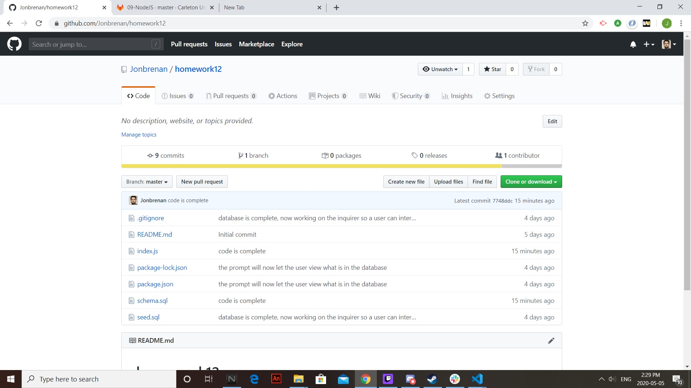
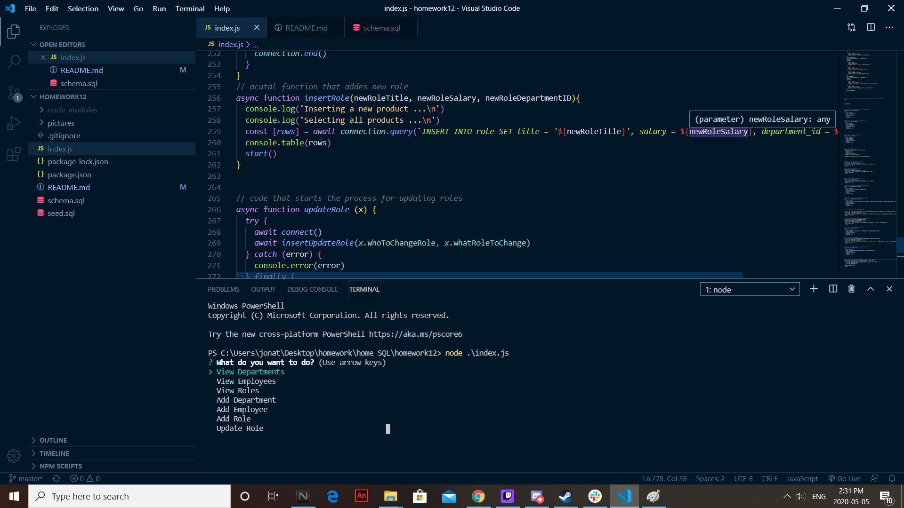

# README Generator

# Description
This project/ code allows a user to interact with SQL databases through the terminal. Specifically, it allows a user to view and change the information regarding employees at a company. With this code, they can view roles, employees and departments, add roles, employees and departments, and update employee roles"
 

* [description](#description)
* [installation](#installation)
* [usage](#usage)
* [license](#license)
* [contributing](#contributing)
* [tests](#tests)
* [questions](#questions)

# Installation
to install the project, simply go to the github repository: https://github.com/Jonbrenan/homework12, and download all files. Or, clone the repository to your computer. Make sure you have mySQL and VsCode installed. All files needed are found in this repository

# Usage
To use the application, simply open the file in a code editing program (VS Code) and find the index.js file. Once index.js has been found, open the terminal and run the command “node index.js”. From here, terminal will prompt the user to input information or select parts of the database to view

# License
Licensed under the [MIT](LICENSE.txt) license
 
# Contributing
To see how one can contribute to the application, simply click the “Contributor Covenant” badge below. 

# Tests
no tests

# Questions

null